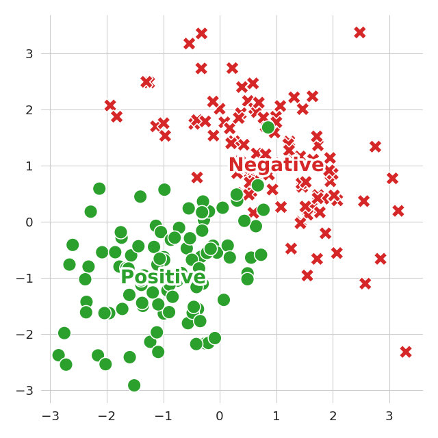
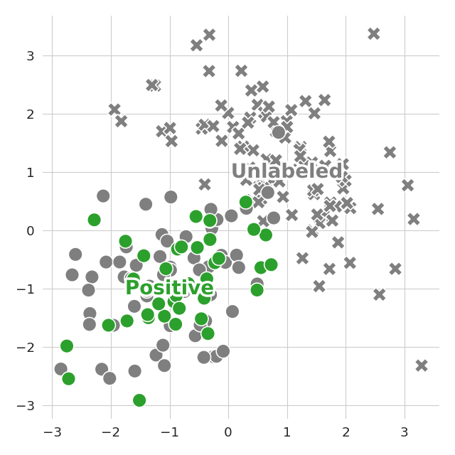

# Empirical Risk Minimization approach for Positive-Unlabeled data

<br>Positive-Negative data|<br>Positive-Unlabeled data
:-:|:-:

## Environment

First, [install uv](https://docs.astral.sh/uv/getting-started/installation/) and [install Python](https://docs.astral.sh/uv/guides/install-python/#installing-a-specific-version).

To reproduce the CPU-only environment use:
```
uv sync --extra cpu
```

To reproduce the CUDA-enabled environment use:
```
uv sync --extra cu126
```

The recommended Python version is 3.12.

## Basic usage

First, [activate the environment](https://docs.astral.sh/uv/pip/environments/#using-a-virtual-environment).

To run training use:
```
python main.py fit --config <path/to/config.yaml>
```

For example:
```
python main.py fit --config configs/kiryo+/mnist/pn.yaml
```

Datasets download automatically.

To view the results use:
```
aim up --repo <path/to/repo/>
```

For example:
```
aim up --repo results/kiryo+/
```

Then, open http://127.0.0.1:43800/.
